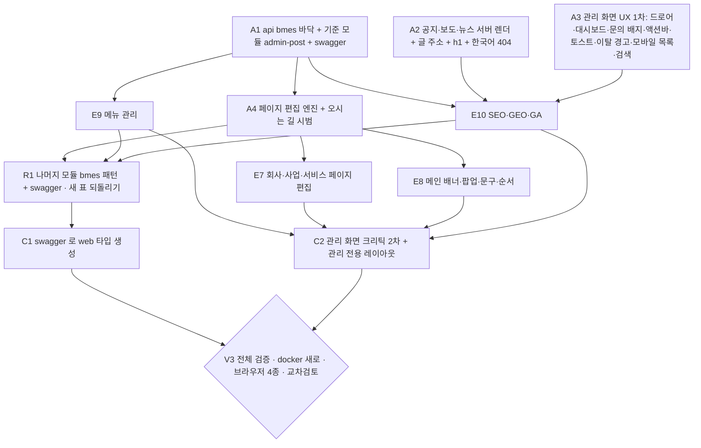

# 작업 그래프 상태 — Directus 를 자체 관리 화면으로 대체 (2026-09-22)

가지 `heysep/cms-편집`. 완료는 「완료 증거」 칸이 차야 ✅.

| 노드 | 상태 | 산출물 | 완료 증거 | 비고 |
|---|---|---|---|---|
| 1. IAM 로그인 Nest 이식 (`core/admin-auth`) | ✅ | api/src/core/admin-auth | 콜백 302 (사용자 클릭, localhost 콜백 통과) · authorize 테스트 6/6 · 커밋 747ed69 | 세션 30분, IAM 내부 API 로 60초 재검(자격 없으면 건너뜀) |
| 2. 데이터 계층 (TypeORM, 기존 테이블) | ✅ | api/src/common/entity · database | count 40, patent-1 번역·그림·번호 읽힘 · 커밋 d028d4f | synchronize 절대 끔. 업로드 data/uploads 로 복사(12) |
| 3. 관리 CRUD API (posts·files·inquiries) | ✅ | api/src/core/admin-* | 업로드 581×788 · 만들기→고치기→순서→지우기 · 400 · 초안 파일 404 · 401 | 파일 삭제·문의 검색/삭제·txt 업로드 추가(미커밋) |
| 4. 공개 API DB 직결 (content·inquiry) | ✅ | api/src/core/content, inquiry | verify.sh 47/53 (Directus 없이; 6건은 A·픽스처 문제) · asset 200 | DirectusService 삭제 |
| A. verify.sh 픽스처를 관리 API 로 | ✅ | api/scripts/verify.sh | `DIRECTUS_URL= bash scripts/verify.sh` → PASS=55 FAIL=0 (2026-09-22, api 3500 재빌드 뒤). Directus REST 호출 0, ADMIN_API_TOKEN 필수 | 검사 53→55: 「세션 비밀 없이는 안 뜬다」·「관리 API 무인증 401」 추가. boot 에 ADMIN_SESSION_SECRET·DB_*·UPLOADS_DIR 전달 |
| B. web `/admin` 화면 | ✅ | web/app/admin/{layout,page,AdminShell,admin.css,login/page,inquiries/page,posts/[board]/{page,PostForm,new/page,[id]/page}}.tsx · web/lib/admin.ts | tsc 통과 · next build 통과(6 라우트) · :3410 curl — /admin/login IAM 버튼 1, ?signed_out 문구 1, /admin·/posts/patent·/new·/inquiries 200, noindex 2, /api 되넘김 401 · 3410 내림 | 메뉴: 게시판 6 + 문의만. 브라우저 실사용(로그인→편집→저장→사이트)은 사용자 확인 필요. 커밋은 부모가 |
| C. 공개 4장 즉시 반영 + web 검사 | ✅ 완료 | web/lib/cms.ts · app/home/news.ts (`cache: 'no-store'`), 4장 + 홈 `dynamic = 'force-dynamic'`, scripts/check-pages.py `NEXT_ORIGIN` 환경변수 | `next build` 5장이 ƒ(요청마다 렌더) · check-src 0문제 · tsc 통과 · check-pages 98/98(:3410) · check-assets 빠진 것 0 · 실측: patent-1 제목에 ' (검증)' PUT → 즉시 `grep -c` 1, 원복 PUT → 0 | 커밋은 부모가 한다 |
| D. Directus 은퇴 | ✅ | docker-compose.yml(db·api·web), api/Dockerfile, db/schema.sql, .env.example, cms/ 삭제, docs | `docker compose ps`: drvalue_directus_pg · drvalue_api 만 · verify.sh 55/55(Directus 없이) · 컨테이너 api 로 posts·asset·admin me 200 · 코드에 Directus 참조는 주석 3줄(이력) | 문서 17개 + 결정 0014. Directus 참조는 결정 파일과 「시절 이름」 설명뿐 |
| V. 최종 교차검토 | ⬜ | | advisor 지적 0 또는 처리 | |

# 2차 — 관리 화면 기능 11 + GA (2026-09-22 저녁)

같은 가지. F(바닥)가 먼저, 그 위에 E1~E6 병렬, 검증 뒤 E7~E11 병렬, 마지막 E0 크리틱.

| 노드 | 상태 | 산출물 | 완료 증거 | 비고 |
|---|---|---|---|---|
| F. 바닥: 권한·이력·문의 칸·채용 칸 마이그레이션 + 역할 가드 + 이력 기록기 | 🔄 | db/migrations/0001, api/common/{revision,role} | 마이그레이션 2회 적용 OK · 가드 테스트 · 글 저장이 admin_revisions 에 행을 남김 | admin_users 비면 = 옛 규칙(IAM/nxcms 통과 = admin) |
| E1. 게시판 3종(뉴스·채용·FAQ) 관리 + 공개 화면 3장 | ✅ | api admin-post(dto·service·controller `faq-categories`)·content(present·order), web PostForm·목록, /page/support/{news,recruit(+[slug]),faq}, lib/menu·cms, check-pages 바닥 | verify.d/boards.sh 10/10(만들기→공개 목록·상세 칸→마감순·FAQ 답+분류→지우기) · 렌더 실측(채용 인턴·마감 배지·상세 본문, FAQ 분류 h3+답, 없는 slug 404) · check-pages 110/110 · check-header 107/107 · check-a11y 323/323 · next build ƒ 3장 | recruit 는 posts.board. news 는 press 장 복제(스크립트 목록) · recruit·faq 는 서버 렌더(JS 없이 보임) |
| E2. 문의 담당자 지정·메모·이메일 답장 | ✅ | api admin-inquiry(dto·error·PATCH status/assignee_email/note·GET assignees·필터 assignee=me\|none\|이메일·q 5칸·@AdminRoles(marketing)·이력), web /admin/inquiries(목록+상세 패널·mailto 답장·types.ts·inquiries.css) | verify.d/inquiry-media.sh 12/12(지정·내 담당/미지정 필터·없는 담당자 400·메모·null 비우기·이력 3건·before=new·hr 403 FORBIDDEN) · verify.sh 97/97 · web build · :3410 /admin/inquiries 200 | 표본 문의는 DB 로 넣는다(공개 API 분당 5회 한도) |
| E3. 미디어 관리 화면(목록·검색·삭제·PDF·영상·용량) | ✅ | api admin-file(GET 목록 type·q·used · PATCH title · DELETE 409/force · mp4·webm · 그림·PDF 20MB/영상 200MB · 한글 파일명 복원 · 이력), web /admin/media(격자·형식 탭·검색·여러 개·끌어다 놓기·상세 패널·주소 복사·인라인 삭제 확인)·lib/admin-media.ts·media.css | verify.d/inquiry-media.sh 11/11(zip 400·영상 필터·이름 변경·used 1·409·force 200·글 그림 비움·미리보기 404·이력 create/update/delete) · verify.sh 97/97 · :3410 /admin/media 200 | 본문 HTML 안 그림은 used 에 안 셈 |
| E4. 예약 게시(publish_at/unpublish_at 자동 상태 전환 + 공개 API 필터) | ✅ | api content LIVE 조건(목록·상세·파일 관문), core/admin-schedule(@nestjs/schedule 1분 틱), PostForm 예약·내림 칸, 목록 배지 | verify.d 예약 8/8(1시간 뒤 글 목록·상세·첨부 404 · 지난 예약 보임 · 내림 지난 글 숨김) · 본문 안 그림 관문: 공개 글 본문에만 넣은 그림 200 → 그 글 초안 404 · 틱 실측: draft+지난 publish_at → published, published+지난 unpublish_at → draft, 둘 다 admin_revisions(schedule@system) · verify.sh 126/126(+판정불가 1, 다른 노드) | 소진한 시각은 지운다(재공개 방지). 조건부 UPDATE 라 프로세스 둘이어도 한 번 |
| E5. 변경 이력 화면 + 이전 버전 복구 | ✅ | api core/admin-revision (GET /revisions · /revisions/item/:c/:id · /revisions/:id · POST /revisions/:id/restore), web /admin/history, lib/admin-extra.ts | verify.d/revision-user.sh: 이력 3건(만듦·고침·고침) · 첫 수정 전으로 복구 → 제목 A · 복구 이력 1건 · 만들기 복구 400 · 지운 글 복구 → 같은 slug·같은 번호 · slug 충돌 409 · 파일 복구 400 — 전부 PASS. api typecheck 0 · web tsc·next build 통과 · :3410 /admin/history 200 | 복구는 엔티티 메타데이터로 칸을 맞춘다(새 칸 자동). TypeORM 이 자동 증가 칸의 id 를 버려 insert 뒤 UPDATE 로 번호를 되돌린다. 메뉴 링크는 부모가 AdminShell 에 붙인다 |
| E6. 권한 화면(고칠 수 있는 범위) + API 가드 | ✅ | api core/admin-user (GET /users · PATCH /users/:email {role}), web /admin/users | verify.d: 목록에 사람 · 해제된 사람 enabled=false · hr 공지 PUT 403 · hr 채용 목록 200 · hr users 403 · hr 이력 403 · 범위 변경 + 이력 · 없는 범위 400 · 없는 사람 404 · POST 없음 404 · IAM 해제된 사람 403 — PASS. 「마지막 admin 내리기 409」 는 켜진 admin 이 2명(실사용자 포함)이라 판정불가 → 규칙은 last-admin.test.mjs 5/5 | **결정(사용자)**: 관리자 여부는 IAM(PLATFORM_ADMIN)만 정한다. 로그인 때 admin_users 동기화(생성·재활성·해제). CMS 는 사람 추가·삭제·사용 여부를 못 바꾸고 범위(admin·marketing·hr)만 바꾼다. 마지막 켜진 admin 강등 409 |
| V1. 1차 검증 | ⬜ | | verify.sh · web 검사 5종 · tsc/build 둘 | |
| E7. 페이지 관리(회사소개·비전·오시는 길·사업·서비스 5장 제목·본문·이미지) | ⬜ | pages 표, /admin/pages, 5장 CMS 우선 | 저장 → 화면 즉시 | 코드 예비 유지 |
| E8. 메인 화면 관리(배너·팝업·문구·순서·링크) | ⬜ | home_settings·banners·popups 표, /admin/home | 배너 순서 바꿈 → 홈 반영 | |
| E9. 메뉴 관리(상단/하단·순서·노출) | ⬜ | menu_items 표, /admin/menu, lib/menu.ts 가 api 를 읽음 | 항목 숨김 → 헤더에서 사라짐 · check-header 통과 | 실패 시 코드 메뉴 |
| E10. SEO(페이지·글별 title·description·OG·noindex) | ⬜ | pageMeta 가 CMS 를 읽음, /admin/seo | OG 이미지 바꿈 → og:image 헤더 반영 | |
| E11. GA4 + 동의 | ⬜ | env GA_MEASUREMENT_ID, SiteScripts | ID 있으면 gtag 실림, 없으면 안 실림 | GTM 은 그대로 |
| V2. 2차 검증 + 문서 | ⬜ | docs · contracts · AGENTS | 검사 전부 · grep 잔재 0 | |
| E0. 로그인·관리 화면 UI/UX 크리틱 + 수정 | ⬜ | | 크리틱 지적 처리 목록 | laws-of-ux · tastemaker audit |

# 3차 — 명세 전부 + UI/UX 크리틱 반영 + SEO/GEO + bmes 패턴 (2026-09-22 밤)

근거: 명세 점검(E7~E11 ⬜) · 관리 화면 감사(주요 9 · 작은 것 9, `.playwright-mcp/ux-*.png`) ·
SEO/GEO 감사(막는 것 2 · 주요 6 · 작은 것 7). 병렬 이유: 노드마다 파일 소유가 갈린다(병렬 분산 후 합치기).
노드는 git worktree 에서 돌고 부모가 합친다. 검사는 노드마다 자기 포트·자기 VERIFY_EMAIL.

A3 합친 뒤 할 것: 관리 목록 검색·상태 필터·쪽 넘김을 브라우저로 — A1 뒤로 잘못된 값은 400(A3 는 대부분 옛 api 로 만들었다). A2 화면(공지 목록·글 한 편·404·머리글) 390/1280 눈 확인 뒤 2차.
출발 조건: 1차 A1·A2·A3 동시. 합치는 순서 A1 → api 컨테이너 다시 → A2·A3 → web 다시 → verify·web 검사 7종·브라우저 390/1280.
2차(A4·E9·E10·A3b)는 1차 셋을 다 합친 뒤. 3차(E7·E8·R1)는 A4·E9·E10 뒤. 4차(C1·C2) → V3.
1차가 도는 동안 부모 트리에서 verify 를 돌리지 않는다(A1 의 verify 가 공유 DB 에 잠깐 글을 게시한다).
합칠 때 고칠 것: post-file.entity.ts 의 파일 쪽 onDelete 가 'SET NULL' 인데 DB 는 CASCADE(0003).

| 노드 | 상태 | 산출물 | 완료 증거 | 비고 |
|---|---|---|---|---|
| P0. 검사 격리 · 규칙 한 곳 · 첨부 FK | ✅ | verify.sh VERIFY_EMAIL·check_rl, /me boards, migrations/0003, robots 파일 경로 | 7586c0b · 109d223 · e779ce3 · verify 146/0/1 | web 의 canEditBoard 사본 삭제. 첨부 고아 행 52 정리 |
| A1. api bmes 바닥 | ✅ | common/typeorm(ctx·@Transactional·BaseRepository)·@ServiceException·검증+swagger DTO 데코레이터·/api/docs(운영 끔), admin-post 전환, 예약 목록 필터 | 합침 b8e0c0c · 부모 docker api 에서 verify 161/0/1 · node --test 20/20 · admin-post 서비스 8/8 @ServiceException+JSDoc · 컨트롤러 8/8 @ApiOperation · 서비스의 QueryBuilder/DataSource 0 · 저장소 3/3 BaseRepository · web 게시판·페이지·홈 검사 통과 | 권한 구멍 수정: 순서 바꾸기가 게시판 범위를 안 봤다(인사가 공지 순서를 바꿈). DB 비밀번호를 import 때 읽던 것(forRootAsync). 목록 질의가 이제 잘못된 값에 400 |
| A2. 게시판 서버 렌더 | ✅ | notice·press·news 목록+상세 서버 렌더, 옛 ?id= 308, h1, not-found | 합침 f1da062 · 부모 docker web 에서 check-boards 35/35 · src 0 · copy 0 · assets 0 · home 23/23 · header 107/107 · a11y 323/323 · pages 110/110 · 옛 ?id= 308 → /notice/legacy-… · 없는 글 404 | 규칙 4 수리. 브라우저 눈 확인은 A3 가 브라우저를 놓은 뒤 |
| A3. 관리 UX 1차 | ✅ | 서랍 메뉴·대시보드·문의 배지·저장 막대·알림·이탈 확인·모바일 카드·검색 주소·입력칸·삭제 확인·연혁 묶음·이력 말·게시판별 칸·건너뛰기 | 합침 · web 검사 8종 통과(copy 451곳 0) · 브라우저: 목록 검색·상태 필터 요청 4건 전부 200(A1 의 400 규칙과 맞음) · A3 측정표(390 미디어 375/375, 본문 시작 52px, 로그아웃 대비 16.27:1) | 일부: 이탈 보호(브라우저 뒤로 가기 못 막음) · 삭제 되돌리기 없음 · 연혁 끌어 옮기기 없음. api 요청: GET /inquiries/:id · 대시보드 요약 한 번에 |
| A3b. 예약 글 표시·필터 | ✅ | 목록 배지·「예약」「내림 예정」 필터 · GET /admin/dashboard(한 번에) · GET /admin/inquiries/:id | 합침 · 부모 docker verify 176/0/1 · web 8종 통과 · copy 465곳 0 | 화면은 브라우저로 아직 안 봄(C2) |
| A4. 페이지 편집 엔진 | ✅ | page_contents(0004 — 옛 Directus pages 표와 이름을 피함) · 스키마는 api(text·textarea·richtext(sanitize-html)·image·link·list·group) · /admin/pages 자동 폼 · 공개 GET /api/content/pages/:key · 오시는 길 시범 · page-seed.mjs | 합침 · 부모 docker verify 214/0/1 · node --test 30/30 · web 8종 통과 · 오시는 길 CMS 로 렌더(주소 3곳) · A4 실측: 저장→공개 즉시, api 꺼도 기본 글, 390 넘침 없음 | 페이지 이력은 날 JSON·되돌리기 불가(R1·C2). 웹 LocationContent 타입은 손으로 맞춤(C1) |
| E7. 회사·사업·서비스 페이지 | 🔄 | 스키마 · 씨앗(지금 TS 내용) · 0008 | 장마다 저장→반영 · check-pages 110/110 그대로 | |
| E8. 메인 화면 | 🔄 | 배너·팝업(0005) · 홈 문구 스키마 | 순서 바꿈→홈 반영 · 팝업 기간·오늘 안 보기 · check-home 23/23 | |
| E9. 메뉴 관리 | ✅ | site_menu_items(0006, 옛 Directus menu_items 와 이름을 피함) · 공개 GET /api/content/menu · 관리 GET·PUT /api/admin/menu · /admin/menu · 헤더·경로 줄·왼쪽 차례·하단이 getMenu() · 60초 캐시 + 저장 뒤 비우기 | 합침 · 부모 docker verify 194/0/1 · web 8종 통과 · 공개 메뉴 200 · E9 실측: 「뉴스」 숨김→헤더에서 사라짐→복구, api 꺼도 lib/menu.ts | 할 것: sitemap.ts 를 getMenu() 로(E10 뒤) · 메뉴 이력 되돌리기(R1) · 화면 눈 확인(C2) |
| E10. SEO·GEO·GA | 🔄 | 글 SEO 칸·OG·색인 제외 · 정적 장 SEO(0007) · sitemap 글 · robots · JSON-LD · llms.txt · GTM env + 동의 | og:image 25/25 · sitemap 에 글 · JSON-LD 종류 · GTM 없으면 안 실림 | |
| R1. 나머지 모듈 bmes | ⬜ | content·inquiry·admin-* 전환 · 새 표(pages 등) 변경 이력 되돌리기 | 서비스 N/N · 컨트롤러 N/N · verify 전부 | 3차 물결. A4·E9·E10 합친 뒤(admin-revision 을 같이 고치므로) |
| C1. web 타입 생성 | ⬜ | openapi → web/lib/api-types.gen.ts, 낡으면 실패하는 검사 | 생성 검사 0 차이 | 공용 패키지 대신(빌드 범위를 안 바꾼다) |
| C2. 크리틱 2차 | ⬜ | 새 화면 포함 전 화면 · 관리 전용 레이아웃 | 감사 지적 처리표 | |
| V3. 전체 검증 | ⬜ | | docker 새로 띄움 · verify · web 검사 전부 · 브라우저 4종 · advisor | |
| P1. 지워진 첨부로 저장하면 500 | ✅ | ADMIN_POST_FILE_GONE·THUMB_GONE 409, 폼이 코드로 칸을 짚음 | verify.d/dashboard.sh 포함 176/0/1 · 409 에 오류 로그 0 | 트랜잭션 검사는 이 실행 전용 트리거(그 파일 id 에만)로 |
| P2. 404 장의 작은 것 | 🔄 | 404 에서 `$ is not defined` 2건(jQuery 없이 헤더 스크립트) · 제목이 「공지사항」 · 공개 히어로 제목이 낱말 중간에서 끊김(keep-all 없음, 사이트 전체) | 콘솔 오류 0 · 404 제목 · 390 히어로 | E10 에 넣는다 |
| S1. 본문 HTML 소독 | ⬜ | api 저장 때 허용 태그만(편집기가 만드는 것) · 공개 렌더도 같은 규칙 | <script>·on* 속성이 저장 뒤 사라짐 | 지금은 관리자 글을 그대로 낸다(채용·게시판). 관리자 세션이 털리면 공개 사이트 XSS. security.md 가 이 기계에 없다 |
| S2. multer DoS 권고 4건(high) | ✅ | package.json overrides multer 2.4.0 (@nestjs/platform-express 11.2.5 유지) | npm audit --omit=dev 0 · docker api 에서 verify 214/0/1(업로드·형식 400·영상 필터 포함) | Nest 12(multer 2.4.0 기본)로 올리면 override 를 뺀다 |
| X3. 옛 Directus 표 정리 | ⛔ | pages·page_blocks·pages_translations·menu_items·menu_items_translations(로컬 DB, 코드가 안 씀) | | 지우는 것은 되돌릴 수 없다 — 사용자 결정. 운영 DB 에도 있는지 먼저 본다 |
| X1. 공개 영어 사이트(/en) | ⛔ | | | 영어 원고 1건뿐 · 주소 방식(/en 접두 vs 도메인) 결정 필요. CMS 는 ko/en 칸을 다 받는다 |
| X2. 실제 IAM 로그인 한 번 | ⛔ | | | 사용자 계정이 필요 — 마지막에 한 번 눌러 확인 |
